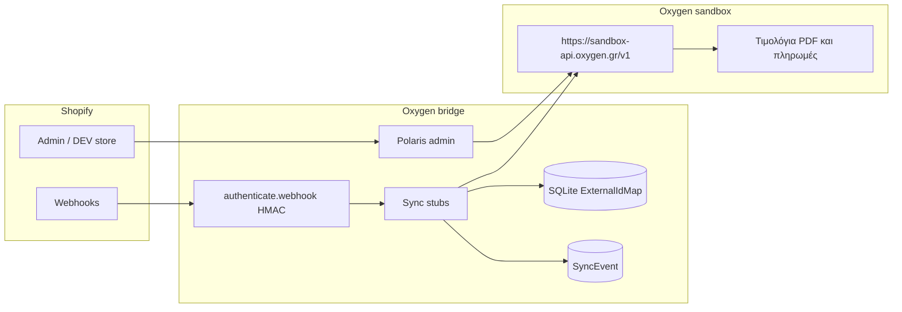

# Γέφυρα Shopify → Oxygen Pelatologio

Custom Shopify app που στέλνει προϊόντα, απόθεμα, παραγγελίες και πελάτες από το Shopify στο [Oxygen Pelatologio](https://oxygen.gr) (ελληνική λογιστική / ERP). Τα παραστατικά εκδίδονται στο Oxygen.

Το Shopify είναι master. Το Oxygen δεν γράφει πίσω στο κατάστημα σε αυτή τη φάση.

Διανομή: `AppDistribution.SingleMerchant` (custom app για έναν έμπορο στο Partner Dashboard). Αυτό το SDK δεν έχει `AppDistribution.Custom`. Δεν είναι δημόσιο App Store app, οπότε τα compliance webhooks μένουν ανενεργά. Η εφαρμογή μένει embedded.

Το επίσημο template της Shopify για νέα apps είναι πλέον **React Router 7** (διάδοχος του Remix template): `@shopify/shopify-app-react-router`, Polaris web components, Prisma, SQLite. Δεν υπάρχει επίσημο Shopify plugin από την Oxygen. Το WooCommerce plugin της Oxygen χρησιμοποιήθηκε μόνο ως μοτίβο (το eshop σπρώχνει παραστατικά στο ERP), χωρίς να αντιγραφεί κώδικας.

## Μην το εγκαταστήσετε στο live κατάστημα

Το live κατάστημα `nth02c-ir.myshopify.com` **δεν** είναι στόχος εγκατάστασης ή deploy. Χρειάζεται ρητή έγκριση του εμπόρου.

- Oxygen **μόνο sandbox**: `https://sandbox-api.oxygen.gr/v1`
- Ο client και το `npm run oxygen:health` απορρίπτουν τον production host `api.oxygen.gr` πριν από οποιοδήποτε HTTP call
- Μην βάλετε production κλειδί ή production URL στο `.env`
- Το `.env` δεν μπαίνει στο git. Αντιγράψτε το `.env.example`

## Αρχιτεκτονική



Οι webhooks καλούν το sandbox (`POST /contacts`, `POST /products`, `PUT /products/{id}`, `POST /invoices`) όταν υπάρχει `OXYGEN_API_KEY`. Χωρίς κλειδί δεν γίνεται κλήση. Το production host `api.oxygen.gr` απορρίπτεται.

OpenAPI (πηγή των πεδίων, έκδοση που διαβάστηκε: v1.25.0): <https://api.oxygen.gr/openapi.json>

### Αντιστοίχιση id: βάση, όχι metafields

Ο πίνακας `ExternalIdMap` κρατά `(shop, entityType, shopifyId) → oxygenId`.

Επιλέχθηκε βάση αντί για metafields επειδή:

- ο συγχρονισμός είναι read-only στο Shopify, άρα δεν χρειάζονται `write_*` scopes
- παραγγελίες, locations και τιμολόγια δεν είναι όλα φυσικοί κάτοχοι metafield
- η αναζήτηση δουλεύει και προς τις δύο κατευθύνσεις
- το dev store και το live store μένουν χωριστά μέσω της στήλης `shop`

`entityType`: `customer`, `variant` (ένα Oxygen product ανά SKU), `inventory_item`, `order` (Shopify order id → Oxygen document id, ώστε το `POST /invoices` να μην ξανατρέξει).

### Webhooks και HMAC

Οι συνδρομές δηλώνονται στο `shopify.app.toml`. Το `authenticate.webhook` ελέγχει το `X-Shopify-Hmac-Sha256` με το `SHOPIFY_API_SECRET`. Λάθος υπογραφή σταματά στο 401, πριν από sync.

| Topic | Route | Συγχρονισμός |
| --- | --- | --- |
| `customers/create`, `customers/update` | `/webhooks/customers/create`, `/update` | upsert επαφής |
| `products/create`, `products/update` | `/webhooks/products/create`, `/update` | ένα Oxygen product ανά variant με SKU |
| `inventory_levels/update` | `/webhooks/inventory_levels/update` | ποσότητα μόνο αν έχει οριστεί αποθήκη |
| `orders/create` | `/webhooks/orders/create` | επαφή μόνο, χωρίς παραστατικό |
| `orders/paid` | `/webhooks/orders/paid` | απόδειξη λιανικής `rp` / myDATA `11.1` |

Δεν έγινε συνδρομή σε `orders/updated`: είναι θορυβώδες και θα κινδύνευε να εκδώσει δεύτερο παραστατικό.

### Idempotency

- Το `X-Shopify-Webhook-Id` αποθηκεύεται στο `SyncEvent`. Αν υπάρχει ήδη με κατάσταση `stub`, `synced` ή `skipped`, η απάντηση είναι 200 χωρίς δεύτερο sync.
- Αποτυχία δεν γράφει το id, ώστε το retry της Shopify (έως 48 ώρες για non-2xx) να ξαναπροσπαθήσει.
- `orders/create` και `orders/paid` έχουν διαφορετικό webhook id. Το τιμολόγιο κλειδώνει στο `ExternalIdMap` με το Shopify order id.
- Το `orders/create` μόνο εξασφαλίζει την επαφή. Το `POST /invoices` ανήκει στο `orders/paid`.

## Κανόνες εμπόρου

1. Πληρωμένη παραγγελία Shopify → απόδειξη λιανικής αγαθών: `document_type` `rp`, myDATA `11.1`. Το `is_paid: true` τη μαρκάρει πληρωμένη. Δεν καλείται και `POST /invoices/{id}/payments`.
2. Τρόπος πληρωμής από το gateway της παραγγελίας, όχι ένα σταθερό id.

   | Shopify | Oxygen (τίτλος από `GET /payment-methods`) |
   | --- | --- |
   | `cash`, `manual`, `cod`, `cash_on_delivery` | Μετρητά |
   | `card`, `shopify_payments`, `stripe`, `credit` | POS / e-POS |
   | `paypal` | PayPal |
   | `bogus`, κενό, άγνωστο | προεπιλογή: Μετρητά, αλλιώς η πρώτη ενεργή μέθοδος, με log |

   Προαιρετικά UUID στο env: `OXYGEN_PAYMENT_METHOD_CASH`, `_CARD`, `_PAYPAL`, `_DEFAULT`. Η λίστα μεθόδων γίνεται cache για 10 λεπτά.
3. ΦΠΑ πάντα 24%. `sale_tax_id` / `tax_id` γραμμής: `2238364a-8b60-4dc6-899c-1d8c63d5ea58`.
4. Ένα Oxygen product ανά Shopify variant. `code` = SKU. Χωρίς SKU το variant παραλείπεται και γράφεται σφάλμα στο log. Δεν επινοείται κωδικός.
5. Μία αποθήκη Oxygen για όλες τις τοποθεσίες Shopify: `OXYGEN_DEFAULT_WAREHOUSE_ID`. Αν είναι κενό, το `inventory_levels/update` δεν γράφει ποσότητα. Η δημιουργία νέου προϊόντος στέλνει `warehouses: [{ id, quantity: 0 }]` και ρίχνει Error αν λείπει το id, αντί για `warehouses: []`. Πελάτες και παραγγελίες συνεχίζουν. Η τιμή καταλόγου θεωρείται μικτή (με ΦΠΑ) και στέλνεται ως `sale_net_amount = price / 1.24`, εκτός αν η παραγγελία έχει `taxes_included: false`.

Το `orders/create` εξασφαλίζει την επαφή και δεν εκδίδει παραστατικό. Το `orders/paid` κάνει `POST /invoices` μία φορά. Αν υπάρχει ήδη `ExternalIdMap` για την παραγγελία, δεν γίνεται δεύτερο POST.

## Φάσεις

1. Επαφές και προϊόντα: υλοποιημένο στο sandbox.
2. Απόθεμα: υλοποιημένο μόνο με `OXYGEN_DEFAULT_WAREHOUSE_ID`.
3. Παραγγελίες → αποδείξεις `rp`: υλοποιημένο στο `orders/paid`.
4. **Live.** Μόνο με έγκριση του εμπόρου. Όχι εγκατάσταση στο `nth02c-ir.myshopify.com`.

## Μεταβλητές περιβάλλοντος

| Μεταβλητή | Ρόλος |
| --- | --- |
| `SHOPIFY_API_KEY` | Client id του app. Το γεμίζει το Shopify CLI σε dev. |
| `SHOPIFY_API_SECRET` | HMAC των webhooks και OAuth. |
| `SHOPIFY_APP_URL` | Δημόσιο URL της εφαρμογής. |
| `SCOPES` | Τα ίδια read scopes με το `shopify.app.toml`. |
| `OXYGEN_API_KEY` | Bearer token sandbox. Κενό = κανένα call. |
| `OXYGEN_API_BASE_URL` | Προεπιλογή `https://sandbox-api.oxygen.gr/v1`. |
| `OXYGEN_DEFAULT_WAREHOUSE_ID` | Μία αποθήκη για κάθε location. Κενό = χωρίς εγγραφή αποθέματος. Το create προϊόντος απαιτεί `warehouses: [{ id, quantity: 0 }]`. |
| `OXYGEN_PAYMENT_METHOD_CASH` | Προαιρετικό UUID για μετρητά. |
| `OXYGEN_PAYMENT_METHOD_CARD` | Προαιρετικό UUID για κάρτα / POS. |
| `OXYGEN_PAYMENT_METHOD_PAYPAL` | Προαιρετικό UUID για PayPal. |
| `OXYGEN_PAYMENT_METHOD_DEFAULT` | Προαιρετικό UUID για άγνωστο gateway. |

Η SQLite βάση είναι `prisma/dev.sqlite` (στο `.gitignore`): sessions Shopify, `ExternalIdMap`, `SyncEvent`.

Scopes στο `shopify.app.toml`: `read_products`, `read_inventory`, `read_orders`, `read_customers`, `read_locations`. Δεν υπάρχουν write scopes. Αν αργότερα χρειαστεί εγγραφή metafield στο Shopify, προστίθεται το αντίστοιχο write scope μόνο με έγκριση.

## Τοπική εκτέλεση

```bash
cp .env.example .env
npm install
npx prisma migrate deploy
npm test
npm run oxygen:health   # skip αν λείπει το OXYGEN_API_KEY
npm run build           # δεν ζητά Shopify Partner login
```

Για embedded dev σε **development store** (όχι στο live):

```bash
npm install -g @shopify/cli@latest
shopify app config link   # DEV app στο Partner Dashboard
npm run dev                # shopify app dev — tunnel, migrate, React Router
```

Το `npm run dev` ανοίγει το Shopify CLI. Δεν το τρέχει το CI και δεν πρέπει να στοχεύει το live κατάστημα.

Σελίδα admin (`/app`): έλεγχος σύνδεσης Oxygen, τελευταίο sync (κενό μέχρι να έρθει webhook), λίστα webhooks.

## Επόμενα βήματα στο Partner / DEV store

1. Shopify Partner account και νέο app από αυτό το repo (`shopify app config link`). Το `client_id` στο toml είναι άδειο μέχρι το link.
2. Εγκατάσταση μόνο σε development store. Όχι `nth02c-ir.myshopify.com`.
3. Αίτημα **protected customer data** στο Partner Dashboard, αλλιώς τα webhooks `customers/*` και `orders/*` έρχονται χωρίς προσωπικά δεδομένα.
4. Sandbox API key στο `.env` (`OXYGEN_API_KEY`) και, για απόθεμα, `OXYGEN_DEFAULT_WAREHOUSE_ID`. Επιβεβαίωση με `npm run oxygen:health` και με το κουμπί «Έλεγχος σύνδεσης».
5. Live deploy μόνο μετά από έγκριση, σε ξεχωριστό βήμα. Όχι εγκατάσταση στο `nth02c-ir.myshopify.com`.

## English

Shopify-master bridge into Oxygen Pelatologio. This repo is a React Router Shopify app (current official template; Remix’s successor) with a sandbox-only Oxygen client, Prisma id map, and HMAC-validated webhooks that call the sandbox API. Distribution is `AppDistribution.SingleMerchant` (custom single-merchant app; this SDK has no `AppDistribution.Custom`). App Store compliance webhooks are not enabled. Do not install or deploy to the live shop `nth02c-ir.myshopify.com` without merchant approval. The only Oxygen API base is `https://sandbox-api.oxygen.gr/v1`. Do not point `OXYGEN_API_BASE_URL` at `https://api.oxygen.gr`. Paid orders become retail receipts (`rp`, myDATA `11.1`) with ΦΠΑ 24% tax id `2238364a-8b60-4dc6-899c-1d8c63d5ea58`. One Oxygen product per variant SKU. Product create sends `warehouses: [{ id, quantity: 0 }]` and throws if `OXYGEN_DEFAULT_WAREHOUSE_ID` is empty. Inventory writes require the same id. Copy `.env.example` to `.env`, then `npm install`, `npx prisma migrate deploy`, and `npm run build`. `npm run dev` needs the Shopify CLI and a **development** store. Field reference: <https://api.oxygen.gr/openapi.json>.
