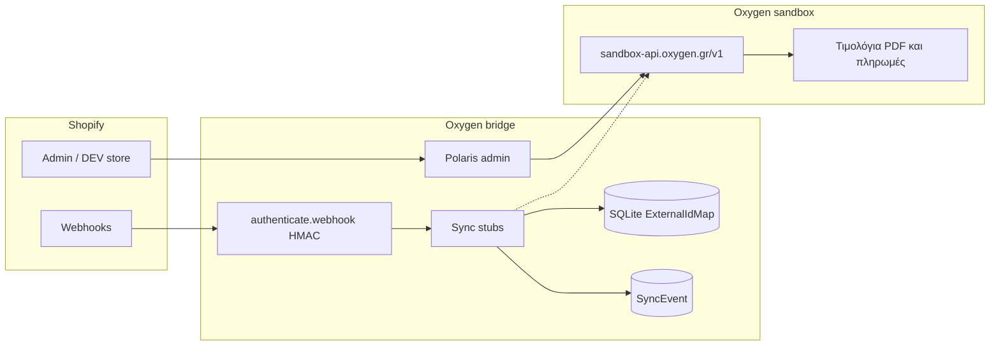

# Γέφυρα Shopify → Oxygen Pelatologio

Custom Shopify app που στέλνει προϊόντα, απόθεμα, παραγγελίες και πελάτες από το Shopify στο [Oxygen Pelatologio](https://oxygen.gr) (ελληνική λογιστική / ERP). Τα παραστατικά εκδίδονται στο Oxygen.

Το Shopify είναι master. Το Oxygen δεν γράφει πίσω στο κατάστημα σε αυτή τη φάση.

Το επίσημο template της Shopify για νέα apps είναι πλέον **React Router 7** (διάδοχος του Remix template): `@shopify/shopify-app-react-router`, Polaris web components, Prisma, SQLite. Δεν υπάρχει επίσημο Shopify plugin από την Oxygen. Το WooCommerce plugin της Oxygen χρησιμοποιήθηκε μόνο ως μοτίβο (το eshop σπρώχνει παραστατικά στο ERP), χωρίς να αντιγραφεί κώδικας.

## Μην το εγκαταστήσετε στο live κατάστημα

Το live κατάστημα `nth02c-ir.myshopify.com` **δεν** είναι στόχος εγκατάστασης ή deploy. Χρειάζεται ρητή έγκριση του εμπόρου.

- Oxygen **μόνο sandbox**: `https://sandbox-api.oxygen.gr/v1`
- Ο client και το `npm run oxygen:health` απορρίπτουν τον production host `api.oxygen.gr` πριν από οποιοδήποτε HTTP call
- Μην βάλετε production κλειδί ή production URL στο `.env`
- Το `.env` δεν μπαίνει στο git. Αντιγράψτε το `.env.example`

## Αρχιτεκτονική



Η διακεκομμένη γραμμή είναι το επόμενο βήμα: τα stubs δεν καλούν ακόμη `POST /contacts`, `POST /products` ή `POST /invoices`. Ο REST client είναι έτοιμος και τον χρησιμοποιεί ο έλεγχος σύνδεσης (`GET /`) όταν υπάρχει `OXYGEN_API_KEY`.

OpenAPI (πηγή των πεδίων, έκδοση που διαβάστηκε: v1.25.0): <https://api.oxygen.gr/openapi.json>

### Αντιστοίχιση id: βάση, όχι metafields

Ο πίνακας `ExternalIdMap` κρατά `(shop, entityType, shopifyId) → oxygenId`.

Επιλέχθηκε βάση αντί για metafields επειδή:

- ο συγχρονισμός είναι read-only στο Shopify, άρα δεν χρειάζονται `write_*` scopes
- παραγγελίες, locations και τιμολόγια δεν είναι όλα φυσικοί κάτοχοι metafield
- η αναζήτηση δουλεύει και προς τις δύο κατευθύνσεις
- το dev store και το live store μένουν χωριστά μέσω της στήλης `shop`

`entityType`: `customer`, `product`, `variant`, `location`, `order` (το order δείχνει στο Oxygen invoice id, ώστε το `POST /invoices` να μην ξανατρέξει).

### Webhooks και HMAC

Οι συνδρομές δηλώνονται στο `shopify.app.toml`. Το `authenticate.webhook` ελέγχει το `X-Shopify-Hmac-Sha256` με το `SHOPIFY_API_SECRET`. Λάθος υπογραφή σταματά στο 401, πριν από sync.

| Topic | Route | Stub |
| --- | --- | --- |
| `customers/create`, `customers/update` | `/webhooks/customers/create`, `/update` | `syncCustomer` |
| `products/create`, `products/update` | `/webhooks/products/create`, `/update` | `syncProduct` |
| `inventory_levels/update` | `/webhooks/inventory_levels/update` | `syncInventory` |
| `orders/create` | `/webhooks/orders/create` | επαφή μόνο |
| `orders/paid` | `/webhooks/orders/paid` | επαφή και μετά τιμολόγιο |

Δεν έγινε συνδρομή σε `orders/updated`: είναι θορυβώδες και θα κινδύνευε να εκδώσει δεύτερο παραστατικό.

### Idempotency

- Το `X-Shopify-Webhook-Id` αποθηκεύεται στο `SyncEvent`. Αν υπάρχει ήδη με κατάσταση `stub`, `synced` ή `skipped`, η απάντηση είναι 200 χωρίς δεύτερο sync.
- Αποτυχία δεν γράφει το id, ώστε το retry της Shopify (έως 48 ώρες για non-2xx) να ξαναπροσπαθήσει.
- `orders/create` και `orders/paid` έχουν διαφορετικό webhook id. Το τιμολόγιο κλειδώνει στο `ExternalIdMap` με το Shopify order id.
- Το `orders/create` μόνο εξασφαλίζει την επαφή. Το `POST /invoices` ανήκει στο `orders/paid`.

## Φάσεις

1. **Επαφές και προϊόντα.** `POST /contacts`, `POST /products`. Πριν γραφτεί προϊόν, να κλειδώσει η στρατηγική variants (ένα Oxygen product ανά SKU ή `/products-groups`) και το `sale_tax_id` από `GET /taxes`.
2. **Απόθεμα.** Αντιστοίχιση Shopify location → Oxygen warehouse (`GET /warehouses`). Το `inventory_levels/update` φέρνει `inventory_item_id` και `location_id`, όχι product id. Η ποσότητα ενημερώνεται με `PUT /products/{id}` στο `warehouses[].quantity`.
3. **Παραγγελίες / τιμολόγια.** Επαφή και μετά `POST /invoices`. Χρειάζονται από τον έμπορο: `payment_method_id`, `mydata_document_type` (πίνακας ΑΑΔΕ 8.1, enum στο OpenAPI), `document_type` (`p` / `rp` / `s` / `rs`) και φόρος γραμμής. Πληρωμή είτε με `is_paid: true` είτε με `POST /invoices/{id}/payments`, όχι και τα δύο. PDF: `GET /invoices/{id}/pdf`.
4. **Live.** Μόνο με έγκριση του εμπόρου, σε ξεχωριστό βήμα από το DEV store. Όχι εγκατάσταση στο `nth02c-ir.myshopify.com` μέσα από αυτό το scaffold.

Πεδία που δεν είναι ξεκάθαρα χωρίς απόφαση εμπόρου μένουν `FIXME` και δείχνουν στο OpenAPI. Δεν επινοήθηκαν κωδικοί myDATA.

## Μεταβλητές περιβάλλοντος

| Μεταβλητή | Ρόλος |
| --- | --- |
| `SHOPIFY_API_KEY` | Client id του app. Το γεμίζει το Shopify CLI σε dev. |
| `SHOPIFY_API_SECRET` | HMAC των webhooks και OAuth. |
| `SHOPIFY_APP_URL` | Δημόσιο URL της εφαρμογής. |
| `SCOPES` | Τα ίδια read scopes με το `shopify.app.toml`. |
| `OXYGEN_API_KEY` | Bearer token sandbox. Κενό = κανένα call. |
| `OXYGEN_API_BASE_URL` | Προεπιλογή `https://sandbox-api.oxygen.gr/v1`. |

Η SQLite βάση είναι `prisma/dev.sqlite` (στο `.gitignore`): sessions Shopify, `ExternalIdMap`, `SyncEvent`.

Scopes στο `shopify.app.toml`: `read_products`, `read_inventory`, `read_orders`, `read_customers`, `read_locations`. Δεν υπάρχουν write scopes. Αν αργότερα χρειαστεί εγγραφή metafield στο Shopify, προστίθεται το αντίστοιχο write scope μόνο με έγκριση.

## Τοπική εκτέλεση

```bash
cp .env.example .env
npm install
npx prisma migrate deploy
npm test
npm run oxygen:health   # skip αν λείπει το OXYGEN_API_KEY
npm run build           # δεν ζητά Shopify Partner login
```

Για embedded dev σε **development store** (όχι στο live):

```bash
npm install -g @shopify/cli@latest
shopify app config link   # DEV app στο Partner Dashboard
npm run dev                # shopify app dev — tunnel, migrate, React Router
```

Το `npm run dev` ανοίγει το Shopify CLI. Δεν το τρέχει το CI και δεν πρέπει να στοχεύει το live κατάστημα.

Σελίδα admin (`/app`): έλεγχος σύνδεσης Oxygen, τελευταίο sync (κενό μέχρι να έρθει webhook), λίστα webhooks.

## Επόμενα βήματα στο Partner / DEV store

1. Shopify Partner account και νέο app από αυτό το repo (`shopify app config link`). Το `client_id` στο toml είναι άδειο μέχρι το link.
2. Εγκατάσταση μόνο σε development store. Όχι `nth02c-ir.myshopify.com`.
3. Αίτημα **protected customer data** στο Partner Dashboard, αλλιώς τα webhooks `customers/*` και `orders/*` έρχονται χωρίς προσωπικά δεδομένα.
4. Sandbox API key στο `.env` (`OXYGEN_API_KEY`). Επιβεβαίωση με `npm run oxygen:health` και με το κουμπί «Έλεγχος σύνδεσης».
5. Με τον έμπορο, πριν γραφτεί πραγματικό sync: αποθήκη ↔ location, φόροι, τρόπος πληρωμής, τύπος παραστατικού myDATA, variants / product groups.
6. Υλοποίηση των stubs με τη σειρά των φάσεων. Live deploy σε ξεχωριστό PR, μετά από έγκριση.

## English

Shopify-master bridge into Oxygen Pelatologio. This repo is a React Router Shopify app (current official template; Remix’s successor) with a sandbox-only Oxygen client, Prisma id map, HMAC-validated webhook routes, and sync stubs. Do not install or deploy to the live shop `nth02c-ir.myshopify.com`. Do not point `OXYGEN_API_BASE_URL` at `https://api.oxygen.gr`. Copy `.env.example` to `.env`, then `npm install`, `npx prisma migrate deploy`, and `npm run build`. `npm run dev` needs the Shopify CLI and a **development** store. Invoice field codes that depend on the merchant are marked `FIXME` and linked to <https://api.oxygen.gr/openapi.json> instead of being invented.
